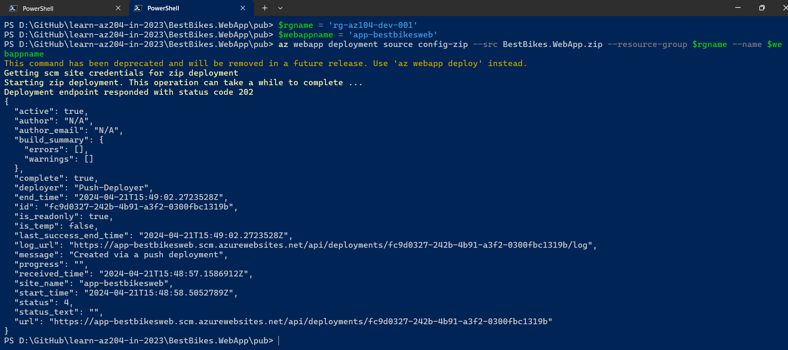

# Learn AZ-104 in 2024

I am learning AZ-104 from different video courses, websites, and books.

## Few Points

> 1. `curl -kL https://localhost:7139/`

```powershell
cd ~/BestBikeApp
dotnet publish -o pub
cd pub
zip -r BestBikes.WebApp.zip *
```

```powershell
$rgname = 'rg-az104-dev-001'
$webappname = 'app-bestbikesweb'
az webapp deployment source config-zip --src BestBikes.WebApp.zip --resource-group $rgname --name $webappname
```



## Sample 2

```powershell
docker pull mcr.microsoft.com/dotnet/samples:aspnetapp

docker image list

docker run mcr.microsoft.com/dotnet/samples:aspnetapp

docker run -p 8080:80 -d mcr.microsoft.com/dotnet/samples:aspnetapp

docker ps
docker ps -a
docker container ls
docker stop elegant_ramanujan

docker start elegant_ramanujan

docker rm elegant_ramanujan

docker container rm -f elegant_ramanujan

docker image rm mcr.microsoft.com/dotnet/core/samples:aspnetapp
```
